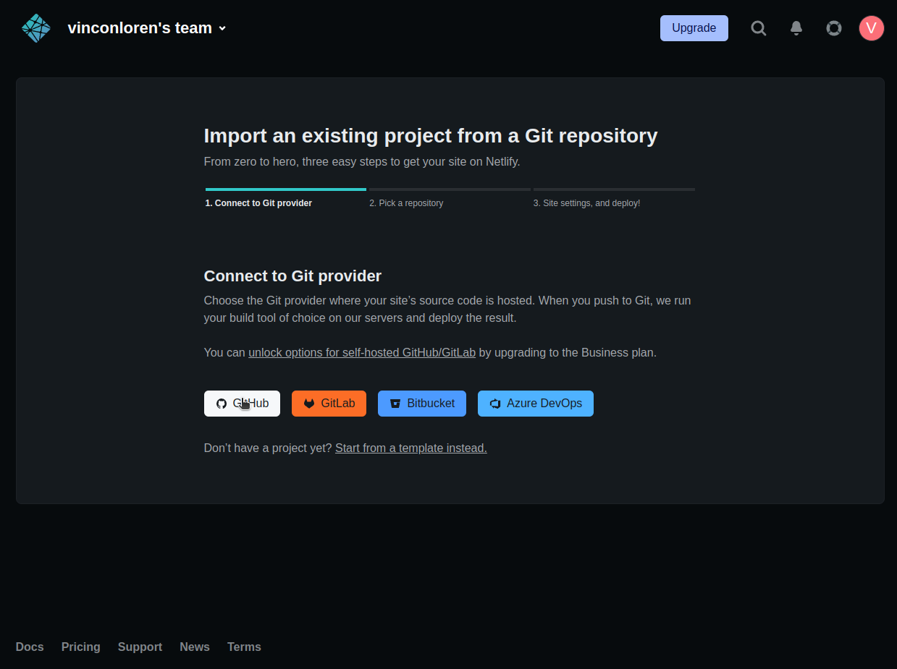

<center style="font-size:250%">Rangkuman Week-1</center>

# Day 1 - Unix Commandline, Git, dan GitHub
## Unix CLI

### Shell
Shell adalah bagian sistem kendali sebuah sistem operasi. Shell menerima perintah dari user dan meneruskannya ke sistem untuk mengendalikannya<br>

Shell dibagi menjadi dua yaitu 
- Command Line Interface (CLI) (berbasis teks)
- Graphical User Interface (GUI) (berbasis grafik)<br>

Contoh Shell:
1. bash
2. zsh
3. cmd.exe

### CLI
- Peserta mampu memahami Command Line Interface <br>
CLI adalah shell berbasis teks yang digunakan untuk berinteraksi dengan sistem operasi.

Struktur penggunaan command line

```bash
$ command -options argument

# $        -> akses non-superuser
# command  -> perintah yang ingin diberikan
# -options -> opsi perintah yang diinginkan
# argument -> tambahan informasi yang diberikan
```
Contoh penggunaan:
```bash
$ python3 -V
  Python 3.10.6
  # perintah menampilkan versi dari python yang terinstall
  # python3 adalah command
  # -V = options
$ python3 main.py
  # main.py adalah argument
  # dalam kasus ini python3 akan menjalankan main.py
```

### Menggunakan Terminal dengan CLI

- Titik menandakan direktori yang sedang aktif
- Cabang pertama adalah isi dari direktori aktif
- Jika isi merupakan folder dan ada isinya maka akan dicabang kembali seperti, catatan dan februari <br>

### Cara melihat active directory
```bash
$ pwd
```

### Cara membuat suatu file dan folder
```bash
$ touch plain.txt
```
file bernama plain dengan tipe .txt akan dibuat pada direktori aktif

```bash
$ mkdir namaFolder
```
folder akan dibuat pada direktori aktif dengan nama namaFolder

### Melihat isi dari direktori aktif
List direktori
```bash
$ ls
```
List direktori melihat file yang disembunyikan
```bash
$ ls -a
```
List direktori melihat detail file
```bash
$ ls -l
```
List direktori melihat detail file dan disembunyikan
```bash
$ ls -la
```

### Berpindah direktori
```bash
$ cd /path/tujuan/
```
Perlu diingat: <br>
- Path yang dimulai dengan karakter / adalah path absolut<br>
  contoh: /home/user/Document adalah path absolut
- Path yang tidak dimulai dengan / adalah path relatif<br>
  contoh: folder/readme.md adalah path relatif

### Melihat isi file
```bash
$ cat <nama-file>
$ head <nama-file>
$ tail <name-file>
```
Sebagai demonstrasi kita ingin melihat isi file text 10 baris bernama yes.txt<br><br>
Mencetak seluruh isi dari file
```bash
$ cat yes.txt
```
Mencetak isi awal dari file
```bash
$ head yes.txt
```
Mencetak isi akhir dari file
```bash
$ tail yes.txt
```
Mencetak 5 baris awal dari file
```bash
$ head -5 yes.txt
```
Mencetak 5 baris akhir dari file
```bash
$ tail -5 yes.txt
```

### Menyalin file
```bash
$ cp [pengaturan] SUMBER TUJUAN
```
Contoh: <br>
Menyalin file bernama no.txt pada direktori aktif ke direktori folder dengan nama nope.txt
```bash
$ cp no.txt ./folder/nope.txt
``` 
Menyalin sebuah folder dengan nama YEET pada direktori aktif ke folder bernama shutup berada di direktori aktif
```
$ cp -r YEET ./shutup
```
Penyalinan folder diharuskan menggunakan pengaturan -r atau recursive, untuk melaksanakan perintah pada file di dalam folder satu-persatu

### Memindahkan file
```bash
$ mv [pengaturan] SUMBER TUJUAN
```
Menyalin file bernama no.txt pada direktori aktif ke direktori folder dengan nama nope.txt
```bash
$ mv no.txt ./folder/nope.txt
``` 
Memindahkan sebuah folder dengan nama YEET pada direktori aktif ke folder bernama shutup berada di direktori aktif
```bash
$ mv -r YEET ./shutup
```
Penggunaan -r memiliki alasan yang sama dengan penyalinan
<br><br>
Merubah nama file yes.txt menjadi true.md berada di direktori aktif pada direktori yang sama
```bash
$ mv yes.txt true.md
```

### Menghapus file dan folder
Penghapusan dapat dilakukan dengan menggunakan perintah.
```bash
$ rm [pengaturan] <nama-file>
```
Menghapus file dengan nama AAAA.why.
```bash
$ rm AAAA.why
```
Menghapus folder dengan nama m8-rly.
```bash
$ rm -r m8-rly
```
Penggunaan -r memiliki alasan yang sama dengan penyalinan atau pemindahan sebuah folder.

## Git/Github
### Git dan GitHub sebagai Alat
Git adalah sebuah alat yang digunakan untuk developer untuk menyimpan perubahan terhadap suatu file. Penyimpanan dapat dilakukan berkala sesuai dengan kebutuhan.

GitHub adalah alat yang digunakan untuk developer untuk menyimpan data pada tempat remote (remote repository) dan dapat melakukan kolaborasi dengan developer lainnya.

### Cara Membuat Repository di GitHub
1. Masuk GitHub
2. pada kanan atas klik tombol + dan pilh **New Repository**
   
3. berikan nama repository, disini skilvul-week2 untuk persiapan tugas minggu depan
   
4. pilih visilibitas file
   
5. boleh ditambahkan README.md jika diperlukan, dan klik **Create Repository**
   
### Alur Development dengan Git dan GitHub
1. Buat repository pada github
2. Tulis ```git init``` pada git bash di direktori yang ingin diupload ke github.
3. Lakukan modifikasi seperlunya pada file.
4. Setelah selesai, dapat user dapat menyambungkan repository lokal dengan remote menggunakan perintah ```git remote add nama remote-repository``` remote-repository didapatkan dengan menyalin lokasi remote http, nama bebas untuk kasus ini menggunakan nama.
5. Tulis ```git add .``` untuk track seluruh file.
6. Tulis ```git commit -m "sebuah pesan"``` untuk menyimpan perubahan di mesin lokal, sebuah pesan dapat diganti menjadi pesan apa saja, -m adalah message.
7. Tulis ```git push nama main``` untuk upload file yang telah di commit pada branch main.

### Cloning GitHub
1. pindah ke lokasi yang diinginkan
2. ketik ```git clone nama-repository``` nama-repository dapat didapatkan di github.

# Day 2 - Hyper Text Markup Language (HTML)
## Apa yang dimaksud dengan HTML?
HTML adalah singkatan dari Hyper Text Markup Language. HTML bisa digambarkan sebagai sebuah tulang dari website, HTML biasanya diketik terlebih daluhu. 
## Ekstension HTML pada VSCode
penulisan menggunakan html dapat menggunakan vscode. VSCode memiliki fitur bernama ekstension, ekstension digunakan untuk mempermudah proses development.
ekstension yang digunakan untuk pembantu development:
1. Live Serverw => menjalankan kode HTML secara lokal, dan otomatis update jika ada perbaruan kode
2. Auto Close Tag => otomatis menutup tag HTML
3. Auto Rename Tag => mengubah nama tag awal dan akhir jika salah satu dirubah
4. Color Picker => memudahkan pemilihan warna
5. Prettier - Code formatter => berguna untuk format kode
- Peserta mampu menggunakan tools pendukung dalam menggunakan HTML 
## Struktur HTML
```html
<!DOCTYPE html>
<html lang="en">
<head>
    <!-- link dokumen css external atau script disini -->
    <meta charset="UTF-8">
    <meta http-equiv="X-UA-Compatible" content="IE=edge">
    <meta name="viewport" content="width=device-width, initial-scale=1.0">
    <title>Document</title> <!-- Judul yang terdapat di tab -->
</head>
<body>
    <!-- HTML tulis disini-->
</body>
</html>
```
## Menjalankan HTML menggunakan Ekstension Live Server VSCode
1. install live server VSCode<br>
   <br>
   
2. Buat dokumen html yang ingin ditampilkan<br>
3. Pilih Explorer pada VSCode<br>
    
4. Klik kanan dokumen HTML yang ingin ditampilkan dan klik open with live server

5. akan muncul jendela baru seperti dengan isi html tersebut
    

## Tag HTML yang Sering digunakan
### h1-h6
tag h digunakan untuk mendefinisikan html heading
```html
<h1>Hello World!</h1>
<h2>Hello World!</h2>
<h3>Hello World!</h3>
<h4>Hello World!</h4>
<h5>Hello World!</h5>
<h6>Hello World!</h6>
```

### p
tag p mendefinisikan paragraph
```html
<p>Hello World!</p>
```
### i
tag i membuat text didalamnya miring (italic)
```html
<i></i>
```
### strong
membuat text didalamnya tebal
```html
<strong></strong>
```
### u
membuat text didalamnya bergaris bawah (underline)
```html
<u></u>
```
### ul / ol
ul = unordered list
ol = ordered list
```html
<ul>
	<li>ternak ikan koki</li>
	<li>ternak ikan mas</li>
	<li>ternak ikan mainan</li>
</ul>
<!-- membuat sebuah list yang tidak bernomor -->

<ol>
	<li>manusia ikan laut</li>
	<li>manusia ikan air</li>
	<li>manusia ikan api</li>
</ol>
<!-- membuat sebuah list bernomor -->
```

### span
biasa digunakan untuk highlight dari paragraph
```html
<span>Hello World!</span>
```
### input
digunakan untuk menerima masukan dari pengguna
```html
<input type="text" placeholder="Hello World!"/>
<!-- type dapat dirubah sesuai kebutuhan seperti radio, checkbox -->
```

### button
digunakan untuk menambahkan tombol bernama text yang dibungkis
```html
<button>Hello World!</button>
```

### script
digunakan untuk menambahkan kode javascript external pada file html
```html
<script src="script.js"></script>
<!-- src adalah lokasi (source) script -->
```
### link
tag untuk menguhungkan file lainnya seperti file css ke dokumen html
```html
<link rel="stylesheet" src="style.css">
<!-- rel menandakan hubungan (relationship), src menandakan lokasi file -->
```
## Semantic HTML
Semantic HTML adalah elemen atau tag yang mendeskripsikan dirinya sendiri dengan jelas kepada developer ataupun browser<br>
### contoh - contoh semantic HTML sering yang digunakan
```html
<article>Hello World!</article>
<!-- menysipkan sebuah artikel -->
```

```html
<aside>Hello World!</aside>
<!-- konten samping seperti iklan-->
```

```html
<figcaption>Hello World!</figcaption>
<!-- menjelaskan suatu gambar-->
```

```html
<figure></figure>
<!-- kontainer sebuah foto -->
```

```html
<footer>Hello World!</footer>
<!-- penutupan webiste -->
```

```html
<header>Hello World!</header>
<!-- awalan website -->
```

```html
<nav>Hello World!</nav>
<!-- kolom navigasi -->
```

```html
<section>Hello World!</section>
<!-- sebuah bagian website -->
```

```html
<summary>Hello World!</summary>
<!-- ringkasan dari website -->
```


## Contoh Portofolio
contoh struktur HTML untuk portofolio
```html
<!DOCTYPE html>
<html lang="en">
	<head>
		<meta charset="UTF-8" />
		<meta http-equiv="X-UA-Compatible" content="IE=edge" />
		<meta name="viewport" content="width=device-width, initial-scale=1.0" />
		<title>V's Portfolio</title>
		<link rel="stylesheet" href="style.css" />
		<script src="script.js"></script>
	</head>

	<body>
		<div id="to-nav"></div>
		<nav>
			
			<ul>
				<li><a href="">Home</a></li>
				<li><a href="">Projects</a></li>
				<li><a href="">Contact Me</a></li>
			</ul>
		</nav>

		<section class="home">
			<div>
				<h1>Hi I'm V welcome to my portfolio</h1>
				<h6>Lorem Ipsum sit amet</h6>
			</div>
			<figure>
				
			</figure>
		</section>
	</body>
</html>
```
HTML diatas dirender menggunakan live server<br>

## Deploy Website Menggunakan Netlify
1. Buka website netlify<br>

2. Masuk Netlify<br>

3. Masuk menggunakan Email (sebetulnya bebas tetapi kasus ini menggunakan email)

4. klik add new site -> import an exsisting project

5. klik github

6. klik install pada jendela baru

7. klik repository yang ingin di deploy

8. klik deploy site

9. tunggu sampai proses deployment selesai, bisa tekan refresh berkala

10. Selesai


# Day 3 - Cascading Style Sheets (CSS)
## Peran CSS pada Web Development
CSS berperan sebagai styling pada html. Bisa dianalogikan sebagai kulit (CSS) pada tulang (HTML). Sehingga HTML yang digunakan menjadi enak dilihat dan cantik.
## Syntax CSS
```css
selector {
	property: value; /* sebuah property dan value adalah deklarasi */
}
```
## Cara-cara menggunakan CSS pada sebuah file HTML
### Inline CSS
inline CSS adalah css yang dituliskan pada tag
```html
<p style="color: #F00;">Hello World!</p>
```
### Internal CSS
internal css adalah css yang dituliskan didalam tag style didalam file html. Tag style dapat dituliskan di head ataupun body

```html
<style>
	p {
		color: #F00;
	}
</style>
```
### External CSS
external css adlah css yang dituliskan diluar file html. lokasi penulisan dapat dimana saja (lokal/cloud) asalkan diberi akses untuk membaca.
```html 
<link rel="stylesheet" href="style.css" />
```
### Urutan penggunaan CSS
prioritas Utama: inline CSS <br>
priotiras tengah: internal CSS <br>
akhir: external CSS <br>

inline CSS > internal CSS > external CSS

## Responsive Webdesign
```css
@media (max-width: 600px) {
	div > p {
		width: 100%
	}
}
```
jika layar layar dibawah 600px maka style yang akan digunakan adalah yang didalam tag media
## Styling Sederhana pada Website Portofolio
```css
* {
    margin: 0;
    padding: 0;
    text-decoration: none;
    list-style: none;
    font-family: sans-serif;
}

img {
    max-width: 100%;
}

nav {
    display: flex;
    justify-content: space-between;
    align-items: center;
    position: fixed;
    width: 100vw;
}

nav ul {
    display: flex;
}

nav ul li{
    padding: 2vw;
}

.home {
    display: flex;
    justify-content: space-around;
    align-items: center;
    height: 100vh;
}

/* selesai dibawah adalah penjelasan */

* {
	/* style untuk SELURUH ELEMEN HTML */
}

.myClass {
	/* style untuk kelas benama myClass */
}

#myId {
	/* style untuk id benama myId */
}

h1, h2 {
	/* style untuk seluruh tag h1 dan h2 */
}

h1 > h2 {
	/* style untuk tag h2 yang memiliki parent h1 */
}

h1 h2 {
	/* style untuk seluruh tag h2 didalam h1 */
}

button:hover {
	/* style ditambahkan ketika mouse diletakkan di atas elemen button */
}
```
### Tampilan Styling Portofolio

# Day 4 - Algoritma
## Algoritma vs Data Structures
### Algoritma
algoritma adalah kumpulan instruksi yang direncanakan dan tersusur berurutan untuk menyelesaikan suatu masalah atau kegiatan.

### Data Structure
Data structure adalah cara menyimpan dan mengatur data secara terstruktur pada sistem program atau sistem komputer

contoh dari struktur data:
1. array
```js
let myArray = [1, 5, 10, 15];
// untuk mengakses 10 bisa menggunakan myArray[2]
```
2. object
```js
let myObject = {
	name : "vinsen"
	jurusan : "elektro"
	nim : "525200005"
}
// untuk mengakses nama menggunakan myObject.name atrau myObject.["name"]
```


## Algoritma Kegiatan Sehari-hari
Kegiatan sehari-hari penuh dengan algoritma. contohnya algoritma berjalan:
```
MULAI
	KAKI_KIRI KE DEPAN
	BADAN KE DEPAN
	KAKI_KANAN DEPAN
SELESAI
```
masuk kelas pagi hari:
```
MULAI
	BANGUN
	MANDI
	IF ADA_WAKTU == TRUE
		MAKAN
	MINUM
	NYALAIN_KOMPUTER
	DUDUK
	BUKA_DISCORD
	KLIK_LINK
	ISI_KETERANGAN
	MASUK_KELAS
SELESAI
```

## Algoritma Sederhana dalam javascript
algoritma penentuan nilai huruf dari angka<br>
- E jika nilai < 50 dan >= 0
- D jika nilai >= 50 dan < 60
- C jika nilai >= 60 dan < 70
- B jika nilai >= 70 dan < 80
- A jika nilai >= 80 dan <= 100

psudo code
```psudo
MULAI
	IF NILAI < 50 DAN NILAI >= 0
		NILAI_HURUF = 'E'
	ELSE IF NILAI >= 50 DAN NILAI < 60
		NILAI_HURUF = 'D'
	ELSE IF NILAI >= 60 DAN NILAI < 70
		NILAI_HURUF = 'C'
	ELSE IF NILAI >= 70 DAN NILAI < 80
		NILAI_HURUF = 'B'
	ELSE IF NILAI >= 80 DAN <= 100
		NILAI_HURUF = 'A'
	ELSE
		NILAI_HURUF = 'nilai tidak valid'
SELESAI
```

algoritma dalam javascript
```javascript
if(nilai < 50 && nilai >= 0) { nilaiHuruf = 'E'; }
else if (nilai >= 50 && nilai < 60) { nilaiHuruf = 'D'; }
else if (nilai >= 60 && nilai < 70) { nilaiHuruf = 'C'; }
else if (nilai >= 70 && nilai < 80) { nilaiHuruf = 'B'; }
else if (nilai >= 80 && nilai <= 100) { nilaiHuruf = 'A'; }
else { nilaiHuruf = 'nilai tidak valid'; }
```

## THE BIG O Notation!
Big O notation adalah cara untuk mendesksripsikan kompleksitas dari kode kita, contohnya O(n) maka kode bersifat linear atau semakin banyak data yang dimasukkan maka waktu atau tempat yang diperlukan porposional dengan jumlah data yang dimasukkan.

```js
for (let i = 0; i < n; i++) {
	/* kode */
	for (let j = 0; j < n - i; j++) {
		/* kode */
	}
}
```
sehingga dapat dituliskan big 
$
O(n^2)
$

proses mendapatkan big O dibawah berdasarkan waktu

$
n*(n - i) = n^2-ni
$
```
n adalah jumlah iterasi for loop pertama
n-i adalah jumlah iterasi for loop kedua
```
untuk big O kita hanya peduli dengan yang paling siknifikan atau disini 
$
n^2
$
sehingga 
$
O(n^2)
$

# Day 5 - Javascript, JS Conditional dan JS Looping
## Javascript
javascript berfungsi untuk menambahkan kehidupan pada sebuah website dengan cara menambahkan interaksi pada wibsite.

javascript dapat dijalankan menggunakan browser dengan cara memulai html live server melalui vscode. File html harus disambungkan atau berisi dengan javascript.

## JS Tipe Data
```js
let str = "string"; // text
let num = 1; // angka
let bool = True; // boolean
let obj = { name : "vinsen" }; // object
let arr = [1, 2, 3];
/*
object berisi nama bisa diakses dengan cara obj.nama 

angka 3 didalam arr bisa diakses dengan arr[2] dikarenakan 
menomoran dimulai dari 0 atau arr[-1].
*/
```
## JS Conditional
| Operator | Penjelasan |
|---|---|
| === | True jika tipe data dan data sama |
| == | True jika data sama |
| != | True jika data tidak sama |
| > | True jika data lebih besar dari |
| < | True jika data lebih kecil dari |
| >= | True jika data lebih besar dari atau sama dengan |
| <= | True jika data lebih kecil dari atau sama dengan |

```js
if (1 < 2) { console.log("1 lebih kecil dari 2"); }
// console akan di cetak 1 lebih kecil dari 2 karena pernyataan benar

if (1 > 2) { console.log("1 lebih besar dari 2"); }
// console tidak akan mencetak apapun karena 1 tidak lebih besar dari 2

if (1 === "1") { console.log("True"); }
// console tidak mencetak karena tipe data berbeda

if(1 == "1" ) { console.log("True"); }
// console mencetak True karena 1 sama dengan 1 meski tipe data berbeda

let value = (1 == 1) ? 'AAA' : 'BBB';
// pernyataan (1 == 1) benar maka value menjadi 'AAA'

value = (1 != 1) ? 'AAA' : 'BBB';
// pertanyaan 1 != 1 maka value menjadi 'BBB'
```
## JS Looping
JS looping dapat mempermudah kita untuk menuliskan program yang berulang-ulang

syntax
```js
for(start_condition; stop_condition; step) {
	// kode yang ingin dijalankan
}
```
contoh penggunaan, untuk mencetak angka 1 sampai 10 bisa menggunakan cara non looping seperti ini

```js
console.log(1);
console.log(2);
console.log(3);
console.log(4);
console.log(5);
console.log(6);
console.log(7);
console.log(8);
console.log(9);
console.log(10);
```
cara diatas "bisa" tetapi tidak baik karena kita harus menuliskan kode yang sama berulang-ulang
alternatif lainnya kita dapat menggunakan for loop
```js
for(let i = 1; i <= 10; i++) {
	console.log(i);
}
```
console akan menampilkan hasil yang sama persis tetapi kode yang digunakan lebih sederhana dan tidak berulang