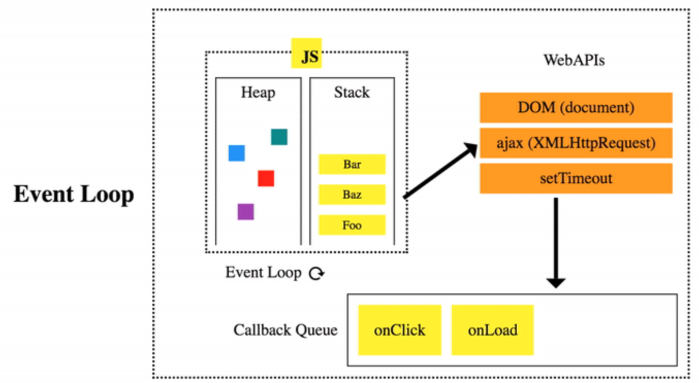

# Asynchronous vs Synchronous

Synchronous JS adalah program yang dijalankan secara berurutan dari atas sampai bawah. Asynchronous JS adalah suatu cara untuk program menjalankan dua atau lebih proses secara bersamaan.

contoh jika ada prosess yang berjalan tetapi memerlukan waktu lebih untuk menyelesaikanya maka js akan menunggu sampai selesai, jika kode tersebut synchronous, jika kode tersebut Async maka akan menjalankan kode lain dan jika proses tersebut selesai langsung dijalankan.

## Event loop

event loop adalah proses dimana 

