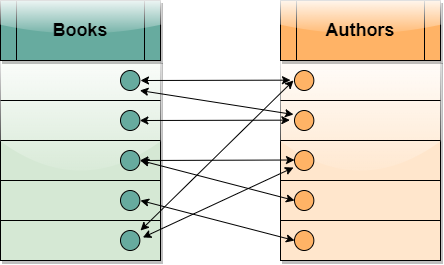

# Database Entity
Entity adalah sebuah obyek yang memiliki data untuk disimpan. Berikut contoh dari entity pada database:

entity digambar adalah mahasiswa dapat dilihat mahasiswa memiliki beberapa attribut, **primary key NIM**, nama, email, tgl-lahir. NIM dibuat menjadi primary key dikarenakan NIM antar mahasiswa tidak mungkin sama.

entity digambar adalah dosen dapat dilihat dosen memiliki beberapa attribut, NIDN, nama, email, tgl-lahir. NIDN dijadikan primary key dikarenakan NIDN dosen tidak akan ada yang sama satu dengan yang lainnya.

# Database Entity Relation
relasi antar entity pada database dapat dibagi menjadi 3
1. 1 to 1
2. Many to 1 (M to 1) / 1 to Many (1 to M)
3. Many to Many (M to M)

## 1 to 1
hubungan setiap data satu sama lain hanya memiliki 1. contoh `1 orang hanya bisa memiliki 1 ktp`

Proses analisis:
1. apakah 1 orang bisa memiliki banyak ktp? **Tidak** (1 to 1)
2. apakah sebuah ktp bisa dimiliki banyak orang? **Tidak** (1 to 1)

## 1 to M
hubungan sebuah entity dengan entitiy lain banyak contohnya:
`1 mahasiswa hanya bisa memiliki 1 mata kuliah favorit.` 

Proses analisis:
1. apakah 1 mahasiswa dapat memiliki banyak mata kuliah favorit? **Tidak** (1 to 1)
2. apakah mata kuliah dapat menjadi favorit banyak mahasiswa? **Ya** (1 to M)

shingga relasi tersebut adalah 1 to Many

## M to M
hubungan sebuah entity dapat banyak berhubungan dengan yang lain, banyak entity lain juga berhubungan dengan entity tersebut. contoh
`dosen dapat mengajar lebih dari 1 mahasiswa dan 1 mahasiswa dapat diajarkan oleh banyak dosen`

Proses analisis:
1. apakah dosen dapat mengajar banyak mahasiswa? **Ya** (1 to M)
2. apakah mahasiswa dapat diajarkan oleh banyak dosen? **Ya** (M to 1)

sehingga relasi adalah M to M. Relasi M to M membutuhkan konjungsi untuk mengubungkan antar relasi. Hubungan dari M to M menjadi M to 1 ke tabel konjungsi.

contoh Hubungan M to M tanpa tabel konjungsi, dapat dilihat data setiap baris saling berhubungan.

hubungan diberikan tabel konjungsi, disini tabel konjungsi berisi kedua ID untuk menghubungkan antar relasi.

# Normalisasi Database
Tujuan database dinormalisasi adalah merapikannya supaya data didalam tabel:
1. tidak redundant
   1. tidak ada data duplikat
2. mudah dicari
3. tidak terjadi anomali
   1. anomali adalah sebuah baris data yang tidak lengkap sehingga ada kolom yang kosong. Data id 3 adalah anomali karena kosong. anomali terjadi akibat insertion, update, delete yang salah.

        |id|data1|data2|
        |---|---|---|
        |1|A|B|
        |2|C|B|
        |3|D||
        |4|E|B|
    
## Database NR

### NR 1
1. Tidak ada urutan penyimpanan data.
2. Harus menggunakan tipe data yang sama di sebuah kolom.
3. Harus ada primary key.
4. Setiap kolom berisi nilai tunggal.

### NR 2
1. Tabel berbentuk NR1.
2. Tidak ada partial depedency. Artinya atribut yang tidak ada hubungannya dengan primary key bisa dipisah. 

Jika sebuah entity mahasiswa berisikan primary key (PK) NIM, nama, email, musik_kesukaan. Maka musik_kesukaan dapat dipisah di tabel berbeda karena musik_kesukaan tidak ada hubugannya dengan PK NIM.

### NR 3
1. Tabel dalam bentuk NR2.
2. Tidak ada transitif depedency. Artinya setiap atribut harus begantung pada primary key.

transitif depedency adalah sebuah data yang bergantung dengan data lain di baris yang sama. contoh data A berubah jika ada perubahan dari data B.

ada range jelek 1-3, baik 4-6. jika ada perubahan data di baris 1, dari 1 ke 5
|id|A|B|
|---|---|---|
|1|1|jelek|

menjadi,

|id|A|B|
|---|---|---|
|1|5|jelek|

data B masih jelek meskipun seharusnya baik, inilah yang disebut dengan transitif depedency