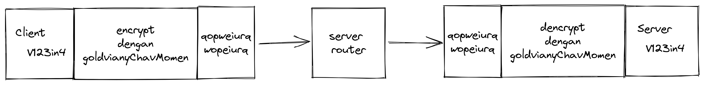
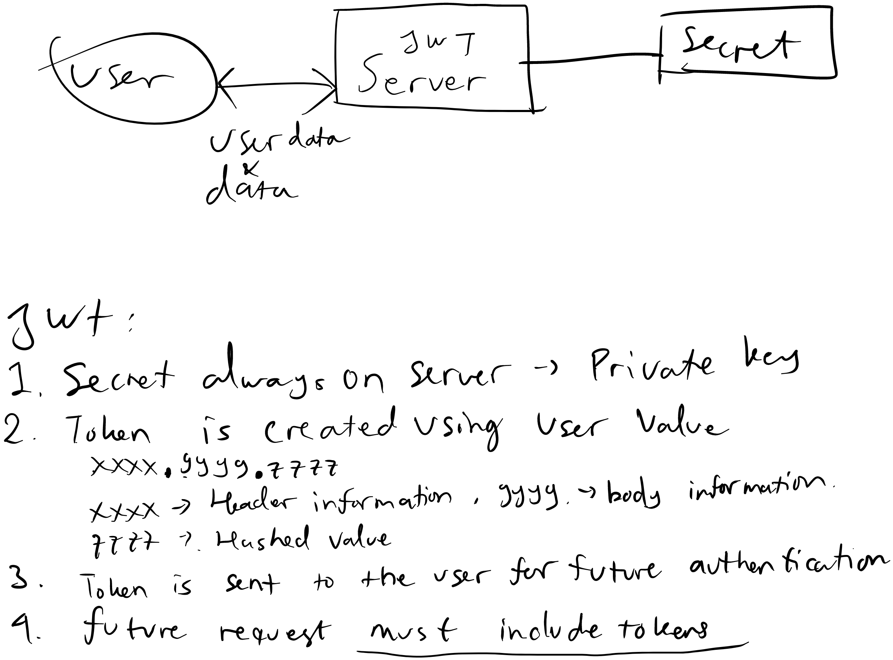

# Authentication
Authorization adalah proses seorang mendapatkan suatu hak akses menggunakan informasi diketahui oleh orang itu dan tempat untku authorisasi pada suatu aplikasi/entity/data.

Contohnya saya login ke [steam](https://store.steampowered.com/), Setelah saya login saya dapat menerima data yang saya diberikan akses seperti game yang sudah dibeli, user data sebuah game yang dimiliki dan dapat membeli game yang belum saya punya.

# Authorization
Authorization adalah proses penentuan apakah orang tersebut yang sudah melakukan authentikasi diizinkan atau ditolak untuk melakukan sebuah aksi terhadap data/informasi pada sistem tersebut. 

Contoh dapat dilakukan pada [steam](https://store.steampowered.com/), Setelah login saya terauthorisasi untuk mengakses data seperti game yang dibeli, memainkan game yang saya miliki, sedangkan saya tidak terauthorisasi mengakses game yang belum saya beli.

# Encryption
enkripsi adalah proses dimana data diamankan saat "perjalanan" sehingga data tersebut tidak dapat diakses/intercept oleh orang yang tidak memiliki "kunci" yang tepat.

contoh:
```
kunci: goldvianyChavMomen

kita disini berasumsi jika data V123in4 di enkripsi menjadi 
qopweiurqwopeiurq dengan kunci goldvianyChavMomen
```


server router disini tidak dapat melihat informasi yang dikirimkan hanya meneruskan, tetapi server yang memiliki kunci yang sama bisa membaca data tersebut.

# Hashing
hashing adalah proses "manghancurkan" data satu arah dengan prosedur. 
Satu arah berarti sekali hash dilakukan hash tidak dapat dikembalikan ke bentuk semula. 
Hashing algorithm akan membuat hasil yang sama dengan data awal yang sama.

contoh dengan data: x menggunakan algoritma SHA256


hash menjadi: 2d711642b726b04401627ca9fbac32f5c8530fb1903cc4db02258717921a4881

hashing biasa digunakan untuk penyimpanan password pada database diserver, sehingga server adminpun tidak dapat melihat data sebelum dihashing. Meski server admin dapat merubah kode untuk masuk sebagai akun lain. Namun penyimpanan demikian baik dikarenakan jika database "bocor" orang yang mengakses password tidak dapat menggunakan data bocor tersebut.
# Salting
salting merupakan proses untuk merubah password dengan cara menambahkan karakter acak untuk merubah nilai sebelum dilakukan hashing.

misalnya ada 2 user yang memiliki password yang sama.
```
A : 12345678
B : 12345678
```
menggunakan SHA-1 akan menjadi 7c222fb2927d828af22f592134e8932480637c0d

didatabase juga akan menyimpan data yang sama oleh karena itu ada salting.

sebelum password di hash ditambahkan huruf acak sebanyak 3 digit
```
A : 12345678qwe
hash SHA-1 : a6e3bdeab0f8b4e36f019537592398112980e163

B : 12345678hdf
hash SHA-1 : 03cf1e8d9b221ba8918e4d4dc415c3aa4cad0b42
```
hash menjadi sangat berbeda meski ditambah salt sedikit saja.

# JWT
 catatan saat kelas

