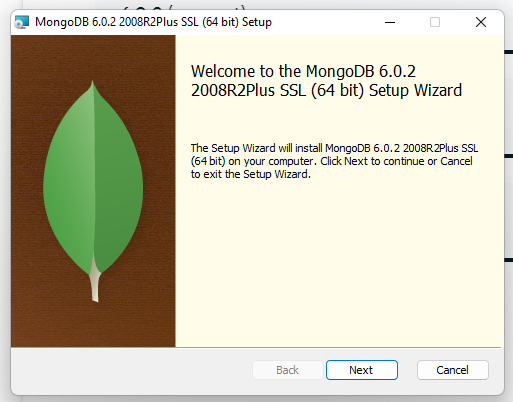
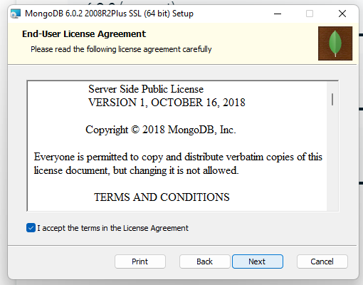
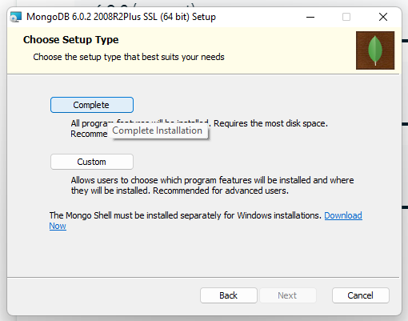
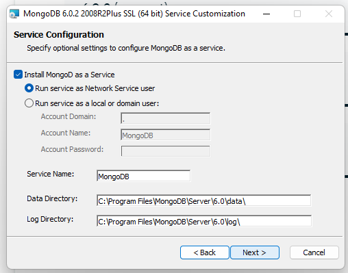
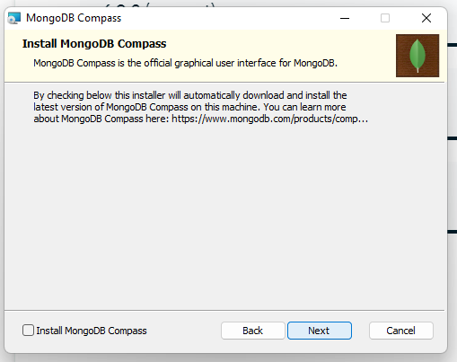
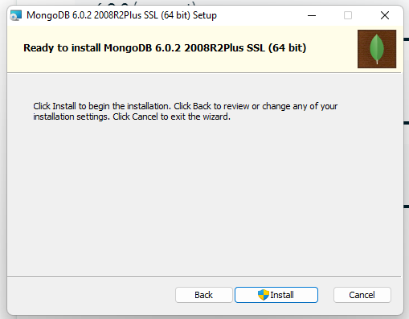

# Perbedaan database mongodb dan mySQL
mongodb adalah database noSQL sedangkan database mySQL adalah database SQL.

lah kok beda?, perbedaan database noSQL dan mySQL berada di tabel. Databasemy SQL memiliki tabel dan setiap tabel memiliki relasi satu dengan yang lain, sedangkan noSQL tidak memliki tabel melainkan data berbentuk JSON.

Database noSQL terdiri dari database, collections, dan documents:

1. database merupakan kumpulan dari collections.
2. collections merupakan kumpulan dari documents.
3. documents merupakan data yang kita simpan.

# instalasi MongoDB
mongoDB dapat diinstall dilinux ubuntu 20.04LTS, tetapi belum ada support untuk 22.04LTS sehingga disini saya menggunakan windows.

download file msi dapat dilakukan.

Cara installasi:
1. download file [disini](https://www.mongodb.com/try/download/community).
2. ikuti proses installasi.
   1. klik next <br> 
   2. centang kotak dan next <br> 
   3. klik complete install <br> 
   4. klik next <br> 
   5. uncheck kotak install mongodb dan klik next <br> 
   6. klik next <br> !

kemudian dikarenakan ada bug di windows 11 maka compass harus di install dan download secara terpisah. Compass sebetulnya tidak essensial tetapi lebih enak digunakan dikarenakan GUI.

Cara installasi:
1. download file [disini](https://www.mongodb.com/try/download/compass).
2. klik file yang didownload tadi dan compass harusnya langsung terinstall.

# CRUD menggunakan MongoDB
## Inisialisasi MongoDB.
1. buka mongoShell
2. lihat database yang ada menggunakan `show dbs`
3. pilih database dengan `use nama-db`
4. buat koleksi pada database tersebut menggunakan `db.createCollections("nama-collection")`

kita telah membuat collection pada database.

## Insert data.
menambahkan data pada sebuah collection bernama "nama-collection"
```
db.nama-collection.insert({
    "key1" : "data1",
    "key2" : "data2",
    ...
    "keyN" : "dataN"
})
```

## Select data.
melihat data pada collection yang baru diinsert tadi.
```
db.nama-collection.find()
```

## Update data.
update data pada sebuah collection

```
db.nama-collection.update({
        'key1':'data1'
    },
    {
        $set:{
            'key1':'data-baru,sibabang-tebel'
        }
    }
)
```

## Delete data.
hapus data dengan key2 pada collection yang diinsert dan update tadi
```
db.nama-collection.remove({
'key1': 'data1'
})
```